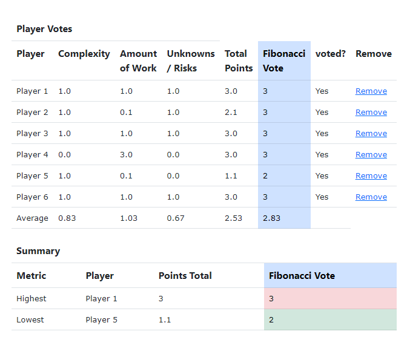

# README

I built Agile poker using inspiration from [pointing poker](https://www.pointingpoker.com/), which allows teams to join a session and quickly be able to size tickets using story points.

Agile poker builds on this idea and allows for some configuration in 3 categories. (complexity, amount of work and unknowns/risks). This was inspired by story pointing techniques, for example in this [training video](https://www.mountaingoatsoftware.com/blog/what-are-story-points) by Mountain Goat software which is a great resource for scrum related topics.

It's not very pretty and I knocked this out as quickly as possible but it does what my team needs it to do.

**Getting it running**

Nothing special, it's a stock standard rails application.
1. Clone the git repository
2. Install dependencies:
   - `bundle install` (Ruby gems)
   - `npm install` (JavaScript dependencies including Bootstrap)
3. Set up the database: `rails db:create db:migrate`
4. Start the application: `bin/dev` (runs both Rails server and JavaScript build watcher)

**Using the application**

There are 3 configurations you can add which each have a top level menu item.
1. Amount of work
2. Complexity
3. Unknowns / Risks

Add at least one record to each of the above.

**Games**

Games are generally used to create different configurations of voting to allow multiple teams to use it. It could have also been called "Teams".

Add your team and then join the game and send out the link to all team members and get them all to join the game.

Then each person votes and after everyone has voted on the story the votes are shows and some calculation are done to give the team summary.

E.G.

